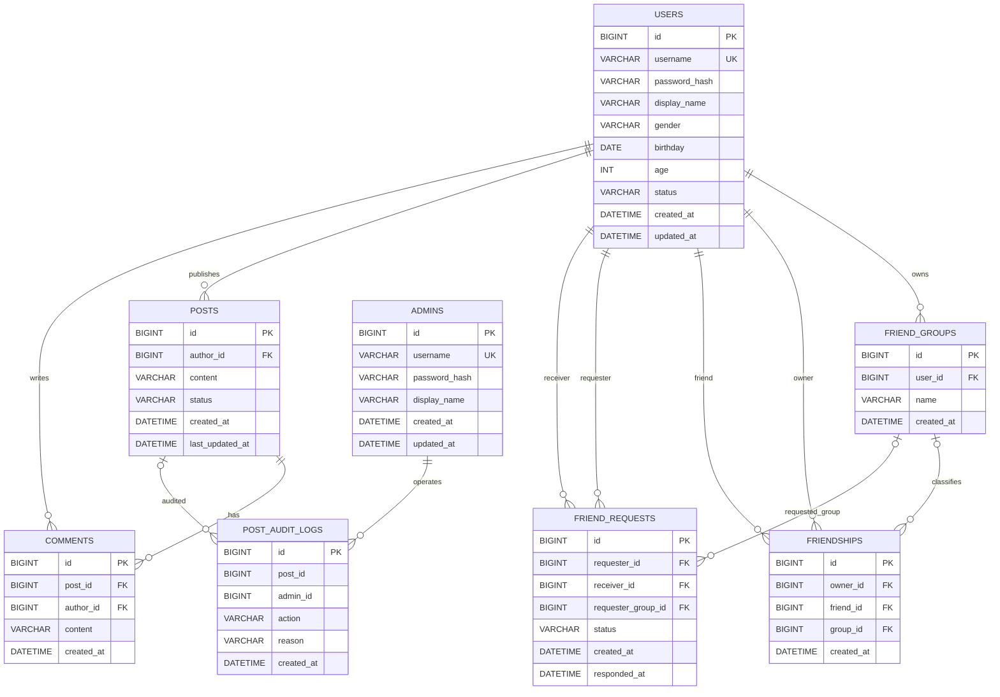

# 2026 Spring 数据库应用开发大作业 Lab5

本项目是一个基于 `Spring Boot + MyBatis + MySQL + Vue3` 的社交平台实验项目，支持用户注册登录、好友申请与分组、朋友圈发布与评论、关键词搜索、DeepSeek AI 文案助手、管理员审核与注销、个人资料与密码管理。

## 技术栈

- Backend: Spring Boot REST API, MyBatis, MySQL
- Frontend: Vue3, Vite, Axios, Vue Router
- AI: DeepSeek Chat Completions API, 仅由后端调用
- Tests: JUnit 5, AssertJ, Vitest, Vue Test Utils

## 分支约定

禁止直接在 `main/master` 分支编辑文件。功能开发使用：

- `feat/核心后端开发`
- `feat/核心前端开发`
- `feat/朋友圈搜索与AI助手开发`

## 快速启动

### 数据库初始化

```bash
mysql -u root -p < sql/schema.sql
mysql -u root -p < sql/seed.sql
```

初始化账号：

- 用户：`alice / 123456`
- 用户：`bob / 123456`
- 用户：`cathy / 123456`
- 管理员：`admin / admin123`

### 启动后端

```bash
cd backend
mvn spring-boot:run
```

默认数据库连接：

- `MYSQL_URL=jdbc:mysql://localhost:3306/lab5_social?useUnicode=true&characterEncoding=utf8&serverTimezone=Asia/Shanghai`
- `MYSQL_USER=root`
- `MYSQL_PASSWORD=`

### 启动前端

```bash
cd frontend
npm install
npm run dev
```

Vite 会把 `/api` 代理到 `http://localhost:8080`。

### DeepSeek 配置

```bash
set DEEPSEEK_API_KEY=你的密钥
set DEEPSEEK_MODEL=deepseek-v4-flash
```

未配置 API Key 时，AI 文案助手会提示错误，但注册、登录、好友、朋友圈、评论、搜索和管理员审核仍可演示。

## 验证命令

```bash
cd backend
mvn test
```

```bash
cd frontend
npm test
npm run build
```

## 文件结构与功能说明

以下结构排除 `.git/`、`.idea/`、`node_modules/`、`dist/`、`target/` 等生成或本地目录；每个列出的文件后都附有一句功能说明。

```text
Lab5/
├── .gitignore  # 配置 Git 忽略本地构建产物、依赖目录和临时文件。
├── AGENTS.md  # 记录项目协作规则、分支策略、安全约束和验收要求。
├── README.md  # 项目说明、运行方式、文件结构和数据库设计文档。
├── Lab5 数据库应用开发大作业.pdf  # 课程 Lab5 大作业原始要求文档。
├── backend/  # Spring Boot 后端工程目录。
│   ├── pom.xml  # Maven 依赖、插件和 Java 版本配置。
│   └── src/
│       ├── main/
│       │   ├── resources/
│       │   │   └── application.yml  # 后端端口、MySQL、DeepSeek 和 MyBatis 配置。
│       │   └── java/com/fudan/lab5/
│       │       ├── Lab5Application.java  # Spring Boot 后端启动入口。
│       │       ├── admin/
│       │       │   ├── AdminController.java  # 管理员资料、改密、朋友圈审核和注销用户接口。
│       │       │   ├── AdminMapper.java  # 管理员资料、密码、审核视图和删除操作的 MyBatis SQL。
│       │       │   ├── AdminPostReview.java  # 管理员审核页返回的朋友圈聚合 DTO。
│       │       │   ├── AdminPostReviewRow.java  # 管理员审核 SQL 的单行映射 DTO。
│       │       │   ├── AdminProfile.java  # 管理员个人资料响应模型。
│       │       │   ├── AdminProfileUpdateRequest.java  # 管理员资料修改请求模型。
│       │       │   └── AdminService.java  # 管理员业务逻辑，包括审核、注销、资料和密码修改。
│       │       ├── ai/
│       │       │   ├── AiController.java  # AI 朋友圈文案生成 REST 接口。
│       │       │   ├── AiDraftRequest.java  # AI 文案生成请求模型。
│       │       │   ├── AiDraftResponse.java  # AI 文案候选结果响应模型。
│       │       │   ├── AiDraftService.java  # AI 文案提示词构造、校验和降级提示逻辑。
│       │       │   ├── DeepSeekClient.java  # DeepSeek 调用抽象接口，便于测试替换。
│       │       │   ├── DeepSeekHttpClient.java  # DeepSeek Chat Completions HTTP 实现。
│       │       │   └── DeepSeekProperties.java  # DeepSeek API Key、base URL 和模型配置绑定。
│       │       ├── auth/
│       │       │   ├── AdminAccount.java  # 管理员登录查询结果模型。
│       │       │   ├── AdminAuthController.java  # 管理员登录和忘记密码接口。
│       │       │   ├── AuthController.java  # 用户注册、登录、登出和忘记密码接口。
│       │       │   ├── AuthMapper.java  # 用户和管理员账号认证相关 MyBatis SQL。
│       │       │   ├── AuthService.java  # 注册、登录、管理员登录和密码重置业务逻辑。
│       │       │   ├── LoginRequest.java  # 登录请求模型。
│       │       │   ├── LoginResponse.java  # 登录成功后的账号身份响应模型。
│       │       │   ├── RegisterRequest.java  # 用户注册请求模型。
│       │       │   └── UserAccount.java  # 用户登录查询结果模型。
│       │       ├── common/
│       │       │   ├── ApiResponse.java  # 统一接口响应包装结构。
│       │       │   ├── CurrentSession.java  # 从 HttpSession 中读取当前用户或管理员身份。
│       │       │   ├── GlobalExceptionHandler.java  # 将业务异常转换成统一 API 错误响应。
│       │       │   ├── PasswordResetRequest.java  # 忘记密码重置请求模型。
│       │       │   ├── PasswordService.java  # 密码哈希与校验服务。
│       │       │   └── PasswordUpdateRequest.java  # 登录后修改密码请求模型。
│       │       ├── config/
│       │       │   └── WebConfig.java  # 后端跨域与 Web 配置。
│       │       ├── friend/
│       │       │   ├── FriendController.java  # 好友、分组和好友申请相关 REST 接口。
│       │       │   ├── FriendGroup.java  # 好友分组模型。
│       │       │   ├── FriendMapper.java  # 好友、分组和好友申请的 MyBatis SQL。
│       │       │   ├── FriendRequest.java  # 发送好友申请请求模型。
│       │       │   ├── FriendRequestRow.java  # 好友申请 SQL 查询行模型。
│       │       │   ├── FriendRequestView.java  # 好友申请页面展示模型。
│       │       │   ├── FriendService.java  # 好友申请、同意、分组管理和双向删除业务逻辑。
│       │       │   ├── FriendView.java  # 好友列表展示模型。
│       │       │   ├── GroupRequest.java  # 新建好友分组请求模型。
│       │       │   └── MoveFriendRequest.java  # 移动好友到分组请求模型。
│       │       ├── post/
│       │       │   ├── CommentCreateRequest.java  # 新增评论请求模型。
│       │       │   ├── CommentSummary.java  # 评论展示摘要模型。
│       │       │   ├── PostController.java  # 朋友圈发布、查看、搜索、评论、修改和删除接口。
│       │       │   ├── PostCreateRequest.java  # 发布朋友圈请求模型。
│       │       │   ├── PostMapper.java  # 朋友圈和评论的 MyBatis SQL。
│       │       │   ├── PostRow.java  # 朋友圈 SQL 查询行模型。
│       │       │   ├── PostService.java  # 朋友圈可见范围、搜索、评论和作者权限业务逻辑。
│       │       │   ├── PostSummary.java  # 前端朋友圈卡片响应模型。
│       │       │   └── PostUpdateRequest.java  # 修改朋友圈内容请求模型。
│       │       └── user/
│       │           ├── ProfileUpdateRequest.java  # 用户个人资料修改请求模型。
│       │           ├── UserController.java  # 用户资料、改密和用户搜索接口。
│       │           ├── UserMapper.java  # 用户资料、密码和搜索相关 MyBatis SQL。
│       │           ├── UserProfile.java  # 用户个人资料响应模型。
│       │           ├── UserSearchResult.java  # 用户搜索结果模型。
│       │           └── UserService.java  # 用户资料、密码修改和搜索业务逻辑。
│       └── test/java/com/fudan/lab5/
│           ├── admin/
│           │   ├── AdminMapperTest.java  # 校验管理员 SQL 包含关键字段和绑定条件。
│           │   └── AdminServiceTest.java  # 校验管理员审核、注销和改密业务逻辑。
│           ├── ai/
│           │   └── AiDraftServiceTest.java  # 校验 AI 文案生成服务的正常与错误场景。
│           ├── auth/
│           │   ├── AuthMapperTest.java  # 校验忘记密码 SQL 使用账号和参数绑定。
│           │   └── AuthServiceTest.java  # 校验用户和管理员忘记密码业务逻辑。
│           ├── friend/
│           │   ├── FriendRequestSchemaTest.java  # 校验好友申请升级 SQL 的关键结构。
│           │   └── FriendServiceTest.java  # 校验好友申请、同意和双向删除逻辑。
│           ├── post/
│           │   └── PostServiceTest.java  # 校验朋友圈搜索、排序和可见范围 SQL。
│           └── user/
│               ├── UserMapperTest.java  # 校验用户密码 SQL 的 active 用户约束。
│               └── UserServiceTest.java  # 校验用户修改密码业务逻辑。
├── frontend/  # Vue3 前端工程目录。
│   ├── index.html  # Vite 应用 HTML 入口。
│   ├── package.json  # 前端依赖、测试和构建脚本配置。
│   ├── package-lock.json  # 前端依赖锁定文件。
│   ├── vite.config.js  # Vite、Vue 插件、测试环境和 API 代理配置。
│   └── src/
│       ├── App.vue  # Vue 根组件。
│       ├── main.js  # 前端应用创建、路由挂载和全局样式引入入口。
│       ├── styles.css  # 全站布局、组件、表单、卡片和响应式样式。
│       ├── api/
│       │   └── client.js  # Axios API 封装，统一调用后端接口。
│       ├── components/
│       │   ├── AiDraftPanel.test.js  # AI 文案助手组件测试。
│       │   ├── AiDraftPanel.vue  # 发布页 AI 文案助手面板。
│       │   ├── AppShell.vue  # 用户端和管理员端共用应用外壳。
│       │   ├── CommentComposer.vue  # 评论输入组件。
│       │   ├── ComposerPanel.vue  # 发布朋友圈输入组件。
│       │   ├── FriendDirectory.vue  # 好友列表、分组管理和好友申请组件。
│       │   ├── PostCard.test.js  # 朋友圈卡片组件测试。
│       │   ├── PostCard.vue  # 朋友圈动态和评论展示卡片。
│       │   ├── ProfileEditor.test.js  # 用户与管理员资料、改密组件测试。
│       │   ├── ProfileEditor.vue  # 用户与管理员资料编辑和修改密码组件。
│       │   ├── ReviewList.test.js  # 管理员审核列表和注销用户组件测试。
│       │   └── ReviewList.vue  # 管理员朋友圈审核、评论明细和注销用户组件。
│       ├── router/
│       │   ├── index.js  # 前端路由、登录重定向和权限守卫。
│       │   └── index.test.js  # 路由重定向和守卫测试。
│       ├── utils/
│       │   └── formatters.js  # 日期、作者名和评论数格式化工具。
│       └── views/
│           ├── AdminLayoutView.vue  # 管理员端布局页面。
│           ├── AdminProfileView.vue  # 管理员资料页面。
│           ├── AdminReviewView.vue  # 管理员朋友圈审核页面。
│           ├── LoginView.test.js  # 登录、空默认值和忘记密码页面测试。
│           ├── LoginView.vue  # 用户、管理员登录、注册和忘记密码页面。
│           ├── UserComposeView.vue  # 用户发布朋友圈和 AI 文案页面。
│           ├── UserFeedView.test.js  # 好友动态流搜索与展示测试。
│           ├── UserFeedView.vue  # 用户首页朋友圈动态流页面。
│           ├── UserFriendPostsView.test.js  # 点击好友查看其动态页面测试。
│           ├── UserFriendPostsView.vue  # 指定好友朋友圈页面。
│           ├── UserFriendsView.test.js  # 好友、分组和申请交互测试。
│           ├── UserFriendsView.vue  # 用户好友管理页面。
│           ├── UserLayoutView.vue  # 用户端布局页面。
│           ├── UserPostsView.test.js  # 我的动态评论、回复、编辑和删除测试。
│           ├── UserPostsView.vue  # 我的朋友圈动态页面。
│           └── UserProfileView.vue  # 用户个人资料页面。
├── sql/
│   ├── schema.sql  # 创建数据库、表、索引、视图和触发器。
│   ├── seed.sql  # 初始化演示账号、好友、朋友圈和评论数据。
│   └── upgrade_friend_requests.sql  # 为已有库补充好友申请表和索引的升级脚本。
└── docs/
    ├── 验收演示脚本.md  # 验收演示流程说明。
    └── superpowers/
        ├── plans/
        │   └── 2026-06-07-lab5-vue3-ai-search.md  # Vue3、搜索和 AI 助手实现计划。
        └── specs/
            └── 2026-06-07-lab5-vue3-ai-search-design.md  # Vue3、搜索和 AI 助手设计规格。
```

## 数据库设计

### ER 图



### 表与约束说明

- `users`: 存储普通用户账号、资料、状态和密码哈希；`username` 唯一，`age` 限制在 `0-150`。
- `admins`: 存储管理员账号和密码哈希；管理员用于审核和注销操作。
- `friend_groups`: 存储用户自定义好友分组；同一用户下分组名唯一。
- `friendships`: 存储双向好友关系中的单向边；删除好友时后端同时删除双方记录。
- `friend_requests`: 存储好友申请；仅允许 `PENDING` 和 `ACCEPTED` 状态。
- `posts`: 存储朋友圈正文、作者、状态、发布时间和最后更新时间；正文长度为 `1-280` 字。
- `comments`: 存储朋友圈评论；评论长度为 `1-160` 字。
- `post_audit_logs`: 存储管理员或系统删除朋友圈、注销用户等审计记录。

### 视图、索引与触发器

- `admin_post_review_view`: 聚合朋友圈及评论数量，供管理员审核列表使用。
- `idx_posts_author_updated`: 加速按作者和更新时间查询朋友圈。
- `idx_posts_content`: 支持朋友圈正文关键词搜索。
- `idx_comments_post_created`: 加速按朋友圈加载评论。
- `idx_comments_content`: 支持评论内容关键词搜索。
- `idx_friendships_owner`: 加速用户好友列表查询。
- `idx_friend_requests_receiver_status`: 加速接收方查看待处理好友申请。
- `idx_friend_requests_requester_receiver_status`: 加速判断重复好友申请。
- `trg_posts_before_update`: 更新朋友圈时自动刷新 `last_updated_at`。
- `trg_comments_after_insert`: 新增评论时自动刷新对应朋友圈的 `last_updated_at`。
- `trg_posts_after_delete`: 删除朋友圈时自动写入审计日志。
